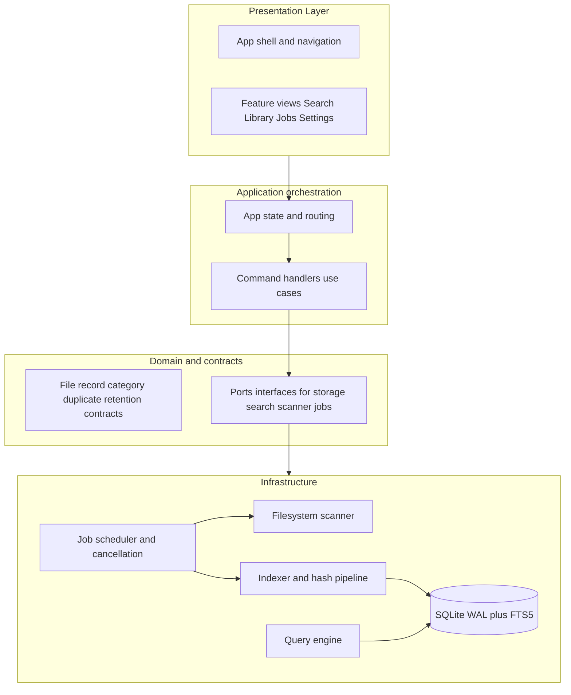

# Vessel File Search — V2 Foundation Plan

## Context

The workspace at [c:\Dev\v2](c:\Dev\v2) is currently **empty**, so there is no V1 code to cite. This plan treats your description of V1 (Tkinter-era UI bottlenecks, “get it working” layering, rough scan/search UX) as the legacy signal and designs **from zero** in a new tree under this folder.

---

## Phase 1 — Product architecture, stack, UX, and how V2 fixes the UI bottleneck

### Proposed V2 architecture (high level)

Use **strict layering** so the UI never does filesystem, SQLite, or heavy CPU work:

**Why this shape:** Future “smart” features (categorization, dedup, retention, Excel generation) become **new use cases + new workers** behind the same ports. The UI stays thin: dispatch intent, subscribe to progress, render virtualized lists.

### Recommended UI framework (primary): **Tauri 2 + TypeScript + a lightweight web UI**

**Recommendation:** **Tauri 2** (Rust core, WebView UI) with **Svelte 5** or **Solid** for the front end (lean reactivity, good for large virtualized lists). React is fine if you prefer ecosystem size over bundle/reactivity overhead.

**Why not “keep Tkinter” (and why this beats typical Python GUI patterns for your goals):**

- **UI thread isolation:** The WebView runs its own event loop; **all** indexing, hashing, SQLite, and path walks live in the Rust side as async tasks or worker threads. V1-style freezes usually come from doing I/O and CPU on the GUI thread—this architecture makes that mistake structurally harder.
- **Polish:** Modern layout, typography, spacing, animations, and component libraries are far ahead of raw Tk for a “real product” feel.
- **Performance at scale:** Rust + SQLite (via `sqlx` or `rusqlite` with careful batching) is a practical fit for **100k–500k+** rows and FTS5 queries without a heavy runtime.
- **Local-first / future AI:** ONNX or other local models can later run in **Rust** or a **sidecar process** with a stable IPC contract; the UI does not need to own model lifecycle.

**Credible alternative (if you want maximum native Windows chrome and a single Microsoft stack):** **.NET 8 + WinUI 3** (MVVM, `Microsoft.Data.Sqlite`, `IHostedService` workers). Excellent Windows polish and tooling; slightly heavier path if you later want macOS/Linux.

**Pragmatic non-choice for V2 foundation:** **Electron alone** as the heavy lifter—possible, but easier to regress into “main process did too much” unless you are very disciplined. Tauri’s Rust boundary encourages the right split.

### Major modules / services

| Area                          | Responsibility                                                                                                                                |
| ----------------------------- | --------------------------------------------------------------------------------------------------------------------------------------------- |
| **App shell**                 | Navigation, theme, global shortcuts, status region, error surfacing                                                                           |
| **Settings**                  | Typed config, paths, exclusions, performance knobs (batch size, hash policy), persisted JSON + validation                                     |
| **Job manager**               | Queue, concurrency limits, cancel, pause/resume, structured progress (phase, counts, ETA hints), crash-safe job state                         |
| **Scanner**                   | Rooted walks, exclusion rules, stable ordering, incremental “what changed” inputs (USN optional later; MVP can use mtime/size + full rescans) |
| **Indexer**                   | Batch inserts/updates, transaction boundaries, dedup keys (hash placeholders), hook points for future enrichers                               |
| **Search**                    | FTS5 queries, path filters, sorting, pagination/cursors for UI virtualization                                                                 |
| **Enrichment (stub)**         | No-op or minimal MIME/category hooks now; same job pipeline later                                                                             |
| **Future: Retention / Excel** | New packages implementing domain rules; no change to shell contract                                                                           |

### UX redesign (product feel)

- **Persistent left rail:** Search · Library (browse/index state) · Activity/Jobs · Settings. Professional apps anchor wayfinding here.
- **Search-first home:** Large query input, recent scopes, saved filters (later). Results as a **virtualized** table/grid with clear columns (path, type, size, modified, tags placeholder).
- **Activity center:** One place for “scanning…”, “indexing…”, “hashing…”, with **cancel** and **last error**—reduces the vague “is it stuck?” feeling from V1.
- **Settings grouped:** Locations & exclusions, Performance, Privacy (what gets hashed/stored), Future “Intelligence” section stubbed.
- **Empty and error states:** First-run wizard: add roots → first index → open search. Copyable error details for support.

### How this solves the V1 UI bottleneck

1. **No long work on the UI thread** — only rendering and input; backend emits **throttled** progress events (e.g., 10–30 Hz max or batch by N files).
2. **Virtualized lists** — never mount 50k DOM rows; windowed data + stable keys.
3. **Explicit job cancellation** — cooperative checks in scan/index loops; UI stays responsive during cancel.
4. **SQLite batching** — transactions sized for SSD (e.g., thousands of rows per commit) to avoid UI-visible stalls from millions of single-row commits.

---

## Phase 2 — Layout, database direction, job model, MVP milestones

### Folder structure (greenfield under `c:\Dev\v2`)

Suggested monorepo-style layout:

- `apps/desktop/` — Tauri app (`src-tauri/`, `src/` for frontend)
- `crates/` (optional later) — shared Rust library if you split core from tauri binary
- `packages/shared-types/` — TypeScript types mirroring Rust DTOs for invoke payloads (optional but helps discipline)

Inside Tauri, keep **feature folders** on the front end (`search/`, `library/`, `jobs/`, `settings/`) and **modules** on the Rust side (`db/`, `scan/`, `index/`, `search/`, `jobs/`).

### Database / schema direction

**Engine:** SQLite with **WAL**, **foreign_keys=ON**, migrations versioned (e.g., `refinery` or hand-rolled SQL migration files).

**MVP tables (illustrative):**

- `roots` — user-configured scan roots, enabled flag, display name
- `files` — `id`, `root_id`, `path` (UTF-8 normalized), `size`, `mtime_ns`, `ctime_ns` (if available), `file_state` (present/missing), optional `quick_sig` (size+mtime) for cheap change detection
- `file_hashes` (optional in MVP, structure early) — `file_id`, `kind` (full/partial), `hash`, `updated_at` — supports future dedup without migration pain
- `fts_files` — FTS5 **external content** or **contentless** design linked to `files`; store searchable text (path tokens, future: extracted text)
- `jobs` — `id`, `type`, `status`, `payload_json`, `progress_json`, `created_at`, `updated_at` — for UI Activity and resume (resume can be phase 1.5)

**Future-oriented columns (nullable / unused in MVP):** `mime`, `category_id`, `confidence`, `duplicate_group_id` — lets you extend without rewrites.

**Scale practices:** indexes on `(root_id, path)`, `(mtime_ns)`, appropriate FTS tokenizer; **avoid** storing huge blobs in row payloads; keep enrichment side tables.

### Async / background job model

**Rust side:**

- A small **JobRuntime** (e.g., `tokio` runtime + bounded worker pool or dedicated thread for SQLite if you choose sync sqlite with a channel).
- Each job = **state machine**: `Queued` → `Running` → `Completed` | `Failed` | `Cancelled`.
- **Progress:** internal `watch` channel or `tokio::sync::broadcast`; Tauri **emits events** to the front end (`job_progress`, `job_finished`).
- **Cancellation:** `Arc<AtomicBool>` or `tokio_util::sync::CancellationToken` checked every N files or every M ms in scanners/indexers.

**Front end:**

- Subscribe to events per active job; **throttle** updates before touching store.
- **Query** job list on mount; don’t rely only on ephemeral events.

### MVP milestones (foundation before “smart” features)

1. **M0 — Scaffold:** Tauri 2 app, TS + chosen UI lib, basic shell + routing + theme.
2. **M1 — Settings:** roots list, exclusions glob patterns, persistence, validation.
3. **M2 — Jobs UI:** list, cancel, progress bars, error display (even with a dummy job first).
4. **M3 — Scan + index MVP:** walk roots, upsert `files`, respect exclusions, incremental updates by quick signature (MVP), emit throttled progress.
5. **M4 — FTS + Search UI:** FTS populate from paths (tokenization strategy), search API with limit/offset, virtualized results.
6. **M5 — Hardening:** large-corpus test notes, WAL tuning, batch size tuning, logging to file, basic crash recovery story for in-flight jobs.

**Explicitly after foundation:** categorization models, duplicate detection passes, retention engine, Excel generator—these plug into `JobRuntime` + new tables/use cases.

---

## Phase 3 — Begin implementation (after you approve this plan)

Execution order (concrete coding steps):

1. Initialize **Tauri 2** project under [c:\Dev\v2](c:\Dev\v2) (or `apps/desktop` if you prefer a monorepo root `package.json`).
2. Add Rust modules: `db` (migrations + pool), `jobs`, `scan`, `index`, `search`, thin `commands` surface for Tauri `invoke`.
3. Add frontend shell: navigation, theme tokens, placeholder views, event listener for job progress with throttling.
4. Implement **M1–M4** in order, with a **dev-only** “generate fake progress” job removed once real scan works.

**Build rules (honored in implementation):** minimal scope per PR/commit, no drive-by refactors, match existing style once files exist, no new markdown docs unless you ask.

---

## Summary choice

**Primary stack:** Tauri 2 + Rust backend + TypeScript UI (Svelte 5 or Solid recommended) + SQLite/FTS5 + explicit job runtime and events. This directly targets **responsiveness**, **polish**, and **scalability** while keeping a **clear path** for local intelligence and compliance-style workflows later—without locking you into cloud services.